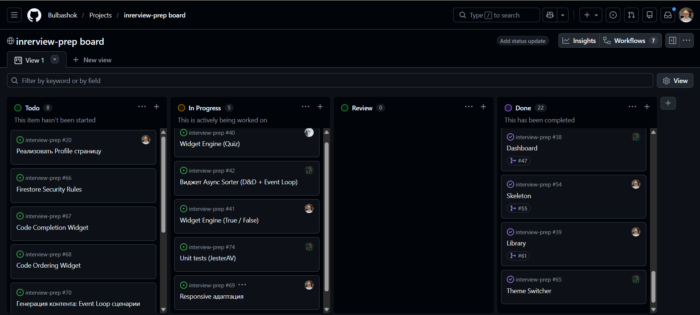

# Interview Prep

Интерактивная платформа для подготовки к техническим собеседованиям на frontend-разработчика. Приложение предоставляет структурированную систему обучения с различными типами виджетов для проверки знаний JavaScript и других веб-технологий.

## Deploy

https://interview-prep-bulbashoks-projects.vercel.app/

## Демо-видео

https://youtu.be/tDoMy4KRH0U

## Чем гордимся

Мы собрали образовательную платформу с нуля, попутно освоив React. Нам удалось быстро разобраться в технологии и выстроить грамотную архитектуру. В процессе внедрили культуру code review и наладили четкую коммуникацию: регулярные созвоны и гибкое планирование помогли уложиться в сроки без потери качества. В итоге получился не просто учебный пример, а готовое приложение для подготовки к интервью

## Команда

- [Коля](https://github.com/NickKool) - [Дневник](development-notes/NickKool/)
- [Лёша](https://github.com/JesterAV) - [Дневник](development-notes/JesterAV/)
- [Миша](https://github.com/Bulbashok) - [Дневник](development-notes/bulbashok/)

## Доска

Мы использовали GitHub Projects для управления задачами и отслеживания прогресса разработки. Все задачи распределялись через доску, что позволяло эффективно координировать работу команды.

**[Ссылка на доску проекта](https://github.com/users/Bulbashok/projects/1/views/1?reload=1)**

## PR с code review

В рамках разработки проводились code review с анализом кода. Вот наиболее содержательные PR:

### [PR #6: Page title](https://github.com/Bulbashok/interview-prep/pull/6)

**Автор:** bulbashok  
**Ревьюер:** NickKool  
**Ключевые комментарии:**

- Отмечено качественное использование `react-helmet-async` для асинхронной среды
- Положительная оценка архитектурного решения: логика управления заголовками инкапсулирована в одном месте
- Корректность интерфейса пропсов и условного рендеринга description

### [PR #27: Интеграция i18n](https://github.com/Bulbashok/interview-prep/pull/27)

**Автор:** JesterAV  
**Ревьюер:** NickKool  
**Ключевые комментарии:**

- Исправление типа данных для ключа title в русской локализации
- Рекомендация добавить ключ langBtn в ресурсы и объект констант i18nKeys
- Размер PR: 56 строк кода

### [PR #47: Dashboard](https://github.com/Bulbashok/interview-prep/pull/47)

**Автор:** NickKool  
**Ревьюер:** JesterAV  
**Ключевые комментарии:**

- Исправление опечаток в коде
- Рекомендация добавить id в History для предотвращения проблем с обновлением истории
- 7 конструктивных комментариев по улучшению кода

### [PR #45: Global Error Handling (Toast system)](https://github.com/Bulbashok/interview-prep/pull/45)

**Автор:** NickKool  
**Ревьюер:** Команда  
**Ключевые особенности:**

- Реализация через React-Hot-Toast
- Глобальный отлов ошибок на main уровне
- Создание централизованной системы уведомлений
- Отправлен на ревью с подробной документацией

## Meeting Notes

Все решения принимались на регулярных командных встречах и в нашем командном чате. Подробные записи встреч доступны в папке `development-notes/`:

- **[2026-02-19](development-notes/Meeting%20Notes%20-%202026-02-19.md)** - Определение стека и инструментов проекта
- **[2026-02-20](development-notes/Meeting%20Notes%20-%202026-02-20.md)** - Распределение задач и утверждение дизайна
- **[2026-03-01](development-notes/Meeting%20Notes%20-%202026-03-01.md)** - Анализ прогресса и перераспределение задач
- **[2026-03-02](development-notes/Meeting%20Notes%20-%202026-03-02.md)** - Обсуждение Firebase интеграции
- **[2026-03-10](development-notes/Meeting%20Notes%20-%202026-03-10.md)** - Обновление доски задач и интеграция i18n
- **[2026-03-11](development-notes/Meeting%20Notes%20-%202026-03-11.md)** - Реализация Global Error Handling
- **[2026-03-16](development-notes/Meeting%20Notes%20-%202026-03-16.md)** - Обсуждение Protected Routes,Library page и архитектуры Quiz
- **[2026-03-18](development-notes/Meeting%20Notes%20-%202026-03-18.md)** - Реализация drag & drop функциональности

## video step by step: 404,spinner,try catch

https://youtu.be/EIHs8nL0cLQ
